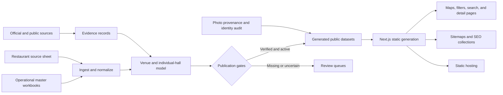

# Viewdding

**An evidence-first Korean wedding discovery platform for venues, gatherings, and planning services.**

Viewdding helps couples compare wedding halls and related services through source-backed conditions—not opaque rankings or photo-first listings. It separates venue-level facts from individual-hall details, preserves unknown values instead of guessing, and exposes the evidence and verification date behind each record.

[Live site](https://viewdding.com) · [Source](https://github.com/Lily-Eunah/viewdding) · [Data methodology](https://viewdding.com/methodology/)


## Data snapshot

The checked-in generated data currently contains:

| Dataset | Scope |
| --- | --- |
| Wedding halls | **436 venues · 663 individual halls · 14 Korean regions** |
| Gathering restaurants | **795 venues · 1,923 exported evidence records** for invitation gatherings and family meetings |
| Wedding styling | **135 personal-color and body-shape consultation providers** |

These counts describe the generated snapshot dated August 9, 2026. Venue operations, prices, minimum guarantees, and other commercial conditions can change; each claim should be read together with its source and checked date.

## What this project demonstrates

- **Evidence-first data engineering:** official and public sources are prioritized, provenance is retained, and unknowns remain unknown.
- **Entity-aware modeling:** a venue and its individual halls are separate records, preventing one hall's capacity, lighting, or ceremony interval from contaminating another.
- **Fail-closed publication:** only records that pass both operational and publication-readiness gates enter the public dataset.
- **Multi-axis discovery:** users can filter by region, guest count, lighting, natural light, venue style, ceremony format, meal type, and interval.
- **Map and search delivery:** server-generated result sets feed Kakao Maps, searchable lists, detail pages, and local favorites without shipping the entire operational master to the browser.
- **Programmatic SEO:** regional and venue-type collections are generated with canonical URLs, sitemaps, structured data, and evidence-complete detail pages.

## Data pipeline



The public web data is generated from operational sources instead of edited directly. Build scripts normalize fields, reject duplicate IDs, separate venues from individual halls, preserve evidence metadata, and emit typed JSON consumed by the application.

## Core data decisions

### Venue and hall are different entities

A hotel, convention center, or wedding venue can operate multiple halls with different capacities, lighting, layouts, and ceremony intervals. Viewdding stores shared venue facts once and hall-specific facts per individual space.

### Classification is multi-axis

One label cannot represent a wedding hall accurately. The data model keeps independent dimensions for:

- Lighting: bright, dark, transitional, or unknown
- Natural light: yes, partial, no, or unknown
- Style: chapel, house, outdoor, indoor, or mixed
- Facility: hotel, convention, public venue, house venue, or other
- Ceremony and dining format
- Capacity, minimum guarantee, ceremony interval, aisle, and ceiling information

Transitional halls can appear in both bright and dark searches when the evidence supports both experiences.

### Unknown is not false

If a venue does not publish a minimum guarantee, ceiling height, or natural-light condition, the pipeline keeps the field unknown. Search results distinguish a confirmed match from a record that does not contradict the filter but still needs verification.

### Publication is gated

Source records must be both publicly approved and operationally active before export. Incomplete candidates remain in review queues rather than being published to increase catalog size.

### Photos are verified data

A usable photo must match the official venue and the specific hall or an explicitly allowed venue-level representation. Logos, notices, awards, meeting rooms, reservation desks, and unrelated spaces are excluded. The photo backfill remains active work; the current repository does not claim complete verified photo coverage.

## Product surface

- Nationwide wedding-hall search with map and list views
- Region, venue-type, guest-count, ceremony, dining, and interval filters
- Individual hall pages with source links and verification dates
- Invitation-gathering and family-meeting restaurant discovery
- Local favorites across venue categories
- Wedding personal-color and body-shape consultation discovery
- Self-snap and wedding-essential curation surfaces
- Mobile filters, bottom navigation, and Kakao Maps integration
- Regional and venue-type SEO landing pages

## Tech stack

| Layer | Technology |
| --- | --- |
| Web | Next.js 16, React 19, TypeScript |
| Rendering | Static export with generated detail and collection pages |
| Maps | Kakao Maps JavaScript API |
| Data | Operational workbooks and source sheets → normalized generated JSON |
| Quality | TypeScript normalization, provenance records, audit queues, Vitest |
| SEO | Metadata API, canonical URLs, sitemap, robots, JSON-LD collections |
| Hosting | Static assets with an edge asset worker |

## Repository structure

```text
src/app/               Search, map, detail, collection, and methodology routes
src/components/        Maps, filters, cards, favorites, and discovery experiences
src/domain/            Typed venue, hall, restaurant, region, and filter logic
src/data/              Generated public datasets and provenance artifacts
src/lib/               Data access, labels, routes, SEO, favorites, and analytics
scripts/               Data generation, geocoding, photo audit, and deployment staging
tests/                 Data, filter, map, evidence, geocoding, photo, and SEO tests
worker/                Static asset worker used by the deployed build
```

## Run locally

### Prerequisites

- Node.js 20.9 or newer
- npm
- A Kakao Maps JavaScript key for map rendering

```bash
npm ci
```

Copy the example environment variables into an untracked local file and set the public Kakao Maps key:

```bash
cp .env.example .env.local
```

Then start the application:

```bash
npm run dev
```

The local site runs at `http://localhost:3000`.

The repository already contains generated public data. Rebuilding source datasets requires the corresponding operational workbook or source-sheet access and should not be run casually.

## Verify changes

```bash
npm run typecheck
npm test
npm run build
```

For a deployment-shaped artifact:

```bash
npm run sites:build
```

The test suite covers normalization, region expansion, filters, maps, geocoding, evidence, hall identity, photo rules, restaurants, analytics, and SEO output.

## Rebuild data carefully

The full data build regenerates multiple checked-in datasets:

```bash
npm run data:build
```

Before running it, confirm the exact source workbooks, sheet access, output diff, and publication gates. Missing values should never be filled by inference merely to make the dataset appear complete.

Photo audit and validation commands are separate from the main build:

```bash
npm run data:hall-photo-audit
npx tsx scripts/validate-photo-backfill.ts
```

## Project status

- Wedding-hall coverage spans Seoul and multiple metropolitan and provincial regions.
- Gathering restaurants, personal-color providers, self-snap, and wedding essentials are available as additional discovery surfaces.
- Venue data, map/filter behavior, regional pages, and source presentation are covered by automated tests.
- Hall-photo verification and provenance backfill are still in progress and should not be described as complete.

## Contact

Partnerships: [partner@viewdding.com](mailto:partner@viewdding.com) · Author: [Eunah (Lily) Yang](https://www.linkedin.com/in/eunah-yang-3a86553a4/)

## License

No open-source license is currently granted. The source is publicly available for portfolio review; all rights are reserved unless a license is added.
